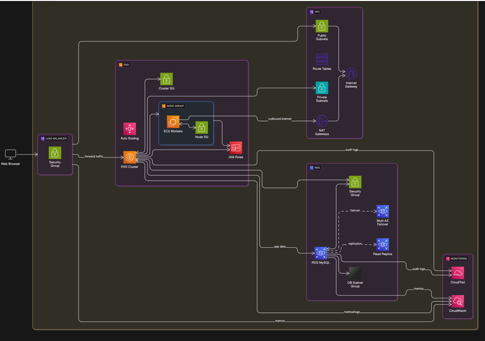
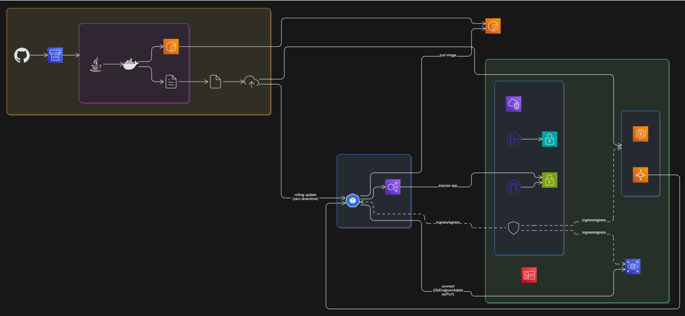
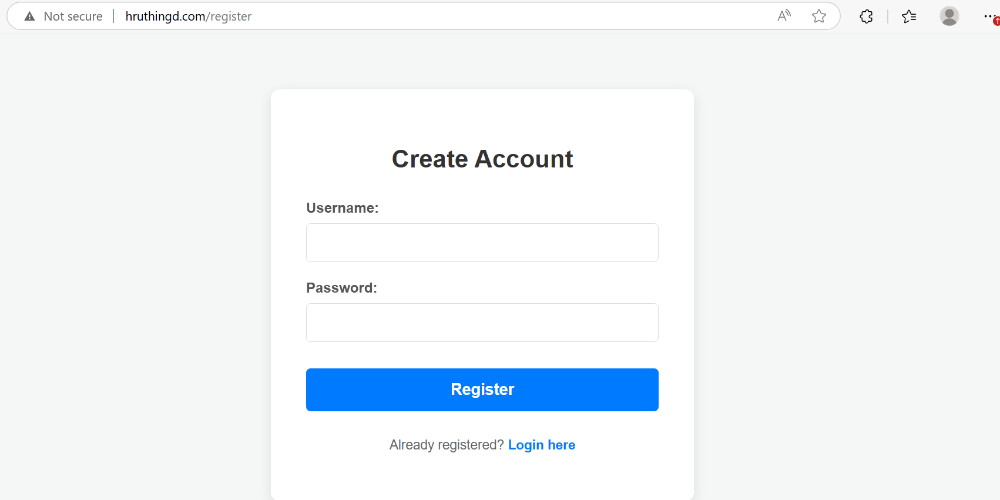

# AWS Multi-Region 3-Tier Infrastructure Deployment using CloudFormation and Terraform

This project provisions a highly available, multi-region 3-tier infrastructure using:
- CloudFormation in Region 1 (e.g., `us-east-1`)
- Terraform in Region 2 (e.g., `us-west-1`)

It includes EKS clusters, private RDS databases, CI/CD with CodePipeline, monitoring with CloudWatch, and notifications using EventBridge.

---

## What This Project Does

- Provisions complete VPC setup with public and private subnets, NAT gateways, route tables, and security groups.
- Creates Amazon EKS clusters in private subnets for application workloads.
- Deploys RDS MySQL instances in isolated private subnets.
- Creates application load balancers (ALBs) in both regions.
- Maps Route 53 domain name to both regional ALBs.
- Uses AWS CodePipeline to automate build, infra provisioning, and deployment.
- Integrates SonarQube and Trivy in the build stage.
- Uses Amazon CloudWatch for centralized monitoring and log collection.
- Uses Amazon EventBridge to trigger notifications on pipeline failure.

---

## Infrastructure Overview

### 3-Tier Architecture

- Web Tier: Public subnets with Application Load Balancer (ALB)
- App Tier: Private subnets with EKS nodes
- DB Tier: Private isolated subnets with RDS MySQL

> Region 1 (CloudFormation), Region 2 (Terraform)

---

## CI/CD Pipeline Flow

1. Code pushed to GitHub triggers CodePipeline
2. Build Stage:
   - Runs Maven build and SonarQube analysis
   - Scans Docker image using Trivy
3. Provisioning Stage:
   - CloudFormation in Region 1
   - Terraform in Region 2
4. Deployment Stage:
   - Pushes image to Amazon ECR
   - Applies manifests to EKS clusters via `kubectl`
5. Monitoring & Alerts:
   - CloudWatch logs for build, application, and infra
   - EventBridge detects pipeline failure and triggers email via SNS/Lambda

---

## Route 53 Configuration

- A hosted zone is created in Route 53
- ALBs from both regions are mapped to the same domain (e.g., `app.yourdomain.com`)
- Supports failover or latency-based routing

---

## Monitoring and Alerts

- **CloudWatch** is enabled for:
  - EKS logs
  - RDS metrics
  - CodeBuild and deployment logs
- **EventBridge** rule captures CodePipeline failure events and triggers:
  - **SNS topic** or
  - **Lambda function** to send an email notification

---

## Tools Used

| Tool             | Purpose                                 |
|------------------|------------------------------------------|
| CloudFormation   | Infra provisioning in Region 1           |
| Terraform        | Infra provisioning in Region 2           |
| Amazon EKS       | Kubernetes cluster (private subnets)     |
| Amazon RDS       | Managed database (private subnets)       |
| Amazon ECR       | Docker image storage                     |
| AWS CodePipeline | CI/CD pipeline automation                |
| SonarQube        | Static code quality analysis             |
| Trivy            | Container image vulnerability scanning   |
| Route 53         | DNS and domain routing                   |
| Amazon CloudWatch| Centralized monitoring and logging       |
| Amazon EventBridge | Pipeline failure event notifications   |

---

## File Structure

.
├── src/                            # Application source code (Java/Spring Boot)
│   └── main/
│       └── resources/
│           └── application.properties
│
├── Dockerfile                      # Docker build file for the application
├── README.md                       # Project documentation
├── buildspec.yml                   # CodeBuild specification for full pipeline
├── cf.yaml                         # CloudFormation template (Region 1 infrastructure)
├── terra.tf                        # Terraform configuration (Region 2 infrastructure)
├── terrabuild.yml                  # Terraform buildspec for CodeBuild
│
├── deployment.yaml                 # Kubernetes deployment manifest for EKS
├── service.yaml                    # Kubernetes service manifest for EKS
├── pom.xml                         # Maven project configuration

